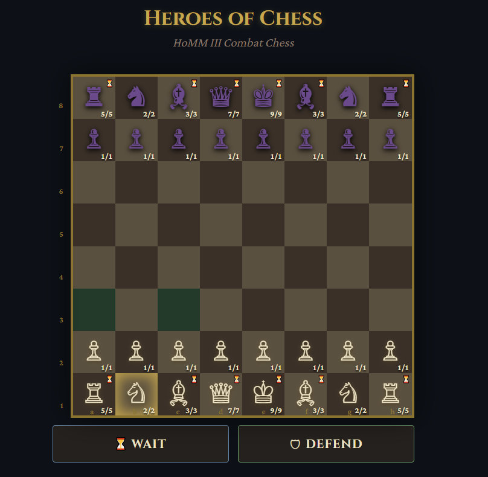

# Герои шахмат / Heroes of Chess

| Русский | English |
|---|---|
| **Герои шахмат** — игра на основе шахмат с боевой системой в духе классики пошаговой тактики. | **Heroes of Chess** is a chess-based game with a classic turn-based combat feel. |
| Автор: **Марат Хамадеев** | Created by **Marat Khamadeev** |
| Сделано с помощью ИИ-агента от **Perplexity** под управлением **Claude Sonnet** | Made with an AI agent by **Perplexity**, powered by **Claude Sonnet** |
| Полные правила: [Русская версия](rules_ru.md) | Full rules: [English version](rules_en.md) |

